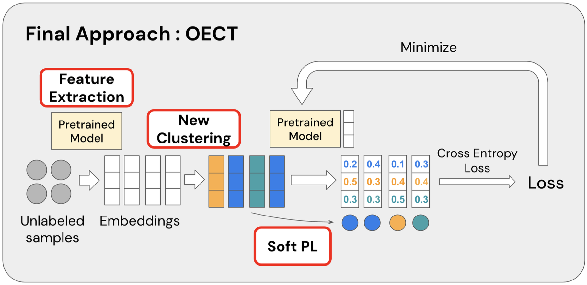

# OECT : Optimized-Embedded Cluster & Tune: Boost Cold Start Performance in Text Classification
* TensorFlow implementation of **Optimized-Embedded Cluster & Tune: Boost Cold Start Performance in Text Classification**.  
[[`Slides`](https://docs.google.com/presentation/d/1henm9FYfTZ6WT7xVNS0hEfOfq098JUm7_sDsC70EDzM/edit?usp=sharing)]
[[`Paper`](https://github.com/s6007541/OECT/blob/main/pdf_files/OECT.pdf)] 

> Contributors: Sorn Chottananurak

## Abstract
In the field of natural language processing, the challenge of insufficient labeled data in specific domains often impedes the effective fine-tuning of Large Language Models (LLMs) like BERT, a phenomenon known as the \textit{cold start problem}. Prior research on domain-adaption has shown that intertraining on domain-specific data between pre-training and fine-tuning stages can enhance model's performance. Cluster and Tune addresses the cold start problem by inter-training BERT using pseudo labels from clustering in the intermediate training phase. Our methodology further builds upon this unsupervised intermediate task by focusing on clustering techniques, loss function, and better feature representation. We rigorously tested our method on both topical and non-topical datasets. Our findings demonstrated a significant improvement in accuracy, particularly in scenarios with a limited number of labeled instances, showcasing the efficacy of our proposed methods in mitigating the cold start problem. 

<p align="center">

</p>

Code to reproduce the BERT intermediate training experiments from [Shnarch et al. (2022)](#reference). 

This repository you can:

(1) Download the datasets used in the paper;

(2) Run intermediate training that relies on pseudo-labels from the results of the [sIB](https://github.com/IBM/sib) clustering algorithm;

(3) Fine-tune a BERT classifier starting from the default pretrained model (bert-base-uncased) and from the model after intermediate training;

(4) Compare the the BERT classification performance with and without the intermediate training stage.


**Table of contents**

[Installation](#installation)

[Running an experiment](#running-an-experiment)

[Plotting the results](#plotting-the-results)

[Reference](#reference)

## Installation
The framework requires Python 3.8
1. Clone the repository locally: 
   `git clone https://github.com/s6007541/OECT.git`
2. Go to the cloned directory 
  `cd OECT`
4. Install the project dependencies: `pip install -r requirements.txt`

   Windows users may also need to download the latest [Microsoft Visual C++ Redistributable for Visual Studio](https://support.microsoft.com/en-us/help/2977003/the-latest-supported-visual-c-downloads) in order to support tensorflow
3. Run the python script `python download_and_process_datasets.py`.
This script downloads and processes 8 datasets used in the paper.

                         
## Running an experiment
The experiment script `run_experiment.py` requires 6 arguments: 
- `train_file`: path to the train data (e.g. datasets/isear/train.csv). 
- `eval_file`: path to the evaluation data (e.g. datasets/isear/test.csv). 
- `num_clusters`: number of clusters used to generate the task pseudo labels. Defaults to 50 (as used in the paper) 
- `labeling_budget`: number of examples from the train data used for BERT fine-tuning (in the paper we tested the following budgets: 64, 128, 192, 256, 384, 512, 768, 1024)
- `random_seed`: used for sampling the train data and for model training
- `inter_training_epochs`: number of epochs for the intermediate task. Defaults to 1 (as used in the paper)
- `finetuning_epochs`: number of epochs for fine-tuning BERT over `labeling_budget` examples. Defaults to 10 (as used in the paper)
- `clustering_algo`: option for alternative clustering algorithms : kmeans, affinity, meanshift, DBSCAN.
- `run_baseline`: evaluate baseline (set to False if would like to avoid comutational cost).
- `pipeline`: option for alternative intermidiate training : entropy and embedding. 
- `cuda`: set gpu cuda device. 
- `lr`: learning rate for intermidiate task. 
- `batch_size`: batch size of intermidiate task.
- `soft_label`: activate soft pseudo-labels in intermidate process.


For example: 

```python run_experiment.py --train_file datasets/yahoo_answers/train.csv --eval_file datasets/yahoo_answers/test.csv --num_clusters 50 --labeling_budget 64 --finetuning_epochs 10 --inter_training_epochs 1 --random_seed 0```

The results of the experimental run (accuracy for BERT with and without the intermediate task over the `eval_file`) are written both to the screen, and to `output/results.csv`. 

Multiple experiments can safely write in parallel to the same `output/results.csv` file - each new result is appended to the file. In addition, for every new result, an aggregation of all the results so far is written to `output/aggregated_results.csv`. This aggregation reflects the mean of all runs for each experimental setting (i.e. with/without intermediate training) for a particular eval_file and labeling budget.


## Plotting the results
In order to show the effect of the intermediate task in different labeling budgets, run `python plot.py`. This script generates plots under `output/plots` for each dataset.

## Reference
Eyal Shnarch, Ariel Gera, Alon Halfon, Lena Dankin, Leshem Choshen, Ranit Aharonov and Noam Slonim (2022). 
[Cluster & Tune: Boost Cold Start Performance in Text Classification](https://aclanthology.org/2022.acl-long.526/). ACL 2022
